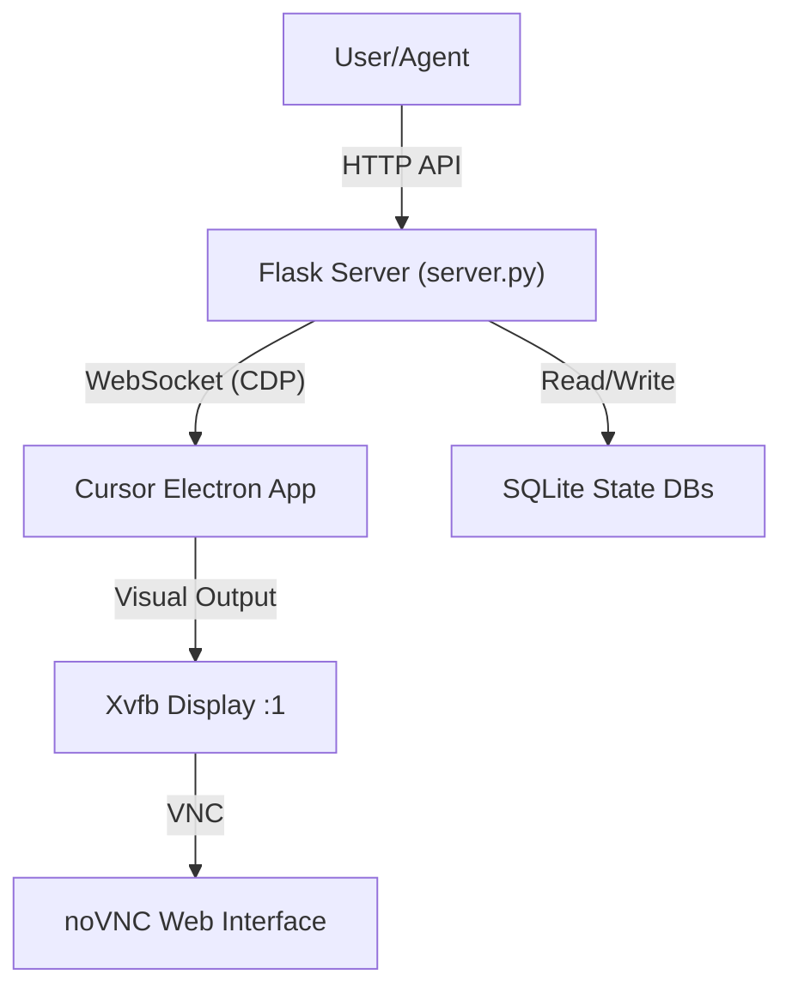

# Cursor Automation System

## Overview
This project provides a fully automated, containerized environment for controlling the Cursor AI code editor. It is designed to be operated by AI agents, allowing them to programmatically interact with Cursor's features, including chat, code generation, and settings, without manual intervention.

The system runs a headless Linux desktop (Openbox) inside Docker, executes Cursor with remote debugging enabled, and exposes a high-level HTTP API for control.

## System Architecture

The system consists of four main layers:



### Components
1.  **Docker Container (`Dockerfile`)**: 
    - Logic: Debian Bookworm base.
    - GUI: Xvfb (virtual framebuffer), Openbox (window manager), x11vnc + noVNC (remote viewing).
    - Dependencies: Python 3, Flask, SQLite, Chromium dependencies.
    - App: Installs Cursor via direct .deb download.

2.  **Cursor Controller (`cursor_api/cursor_controller.py`)**:
    - **Control**: Connects to Cursor's generic internal Chrome DevTools Protocol (CDP) port (9222). It uses this to click buttons (via JS injection) and type text (via Input events).
    - **State**: Reads Cursor's internal SQLite state databases (`state.vscdb`) directly to retrieve chat history and metadata, bypassing the need to scrape the DOM for complex data.

3.  **API Server (`cursor_api/server.py`)**:
    - A Flask application running on port `5000`.
    - Abstracts complex CDP sequences into simple endpoints (e.g., `/login`, `/conversations/new`).

4.  **Database Injector (`cursor_api/inject_cursor_settings.py`)**:
    - Runs at startup.
    - Directly modifies the `state.vscdb` to pre-configure user settings (e.g., enabling "Yolo Mode", "Agent Mode") before Cursor launches.

## API Reference

Base URL: `http://localhost:5000`

### Authentication & Setup
| Endpoint | Method | Description |
|----------|--------|-------------|
| `/health` | `GET` | Checks connection to Cursor CDP. Returns `{"cursor_connected": bool}`. |
| `/login` | `GET` | Clicks the "Log In" button on the welcome screen. |
| `/login-url` | `GET` | Returns the auth URL captured by `stub_xdg_open.sh` during login flow. |
| `/continue` | `GET` | Clicks the "Continue" button (useful for onboarding flows). |
| `/set-deep-mode` | `POST` | Automates UI interactions to set Default Approach to "Deep". |

### Conversation Management
| Endpoint | Method | Description |
|----------|--------|-------------|
| `/conversations` | `GET` | Lists all conversations from the workspace state DB. |
| `/conversations/new` | `POST` | Clicks the "New Chat" button to start a fresh session. |
| `/conversations/send` | `POST` | Types and sends a message. JSON: `{"message": "string"}`. |
| `/conversations/wait` | `POST` | Blocking call that waits until generation stops. |
| `/conversations/status` | `GET` | Returns current generation status (`generating`: bool). |
| `/conversations/<id>` | `GET` | Returns raw message usage for a specific conversation ID. |
| `/conversations/<id>/render` | `GET` | Returns a formatted text representation of the chat, including thinking and tool calls. |

### UI Control
| Endpoint | Method | Description |
|----------|--------|-------------|
| `/sidebar/toggle` | `POST` | Toggles the AI sidebar visibility. |
| `/sidebar/status` | `GET` | Checks if the sidebar is currently open. |
| `/model/change` | `POST` | Switches the AI model. JSON: `{"name": "Sonnet 4.5"}`. |

### Low-Level
| Endpoint | Method | Description |
|----------|--------|-------------|
| `/eval` | `POST` | Executes arbitrary Javascript in the Cursor context. JSON: `{"expression": "alert(1)"}`. |

## Internal Mechanics

### SQLite State Access
Cursor stores its state, including chat history and window layout, in SQLite databases located at:
- Global: `/root/.config/cursor-data/User/globalStorage/state.vscdb`
- Workspace: `/root/.config/cursor-data/User/workspaceStorage/<hash>/state.vscdb`

The `CursorController` reads these DBs to provide reliable access to chat history (`get_conversations`, `get_conversation_content`), which is more robust than parsing the HTML DOM.

### CDP Automation
The controller connects to `localhost:9222` using a raw WebSocket.
- **Clicking**: Uses `Runtime.evaluate` to find elements by selector/text and trigger `.click()`.
- **Typing**: Uses `Input.dispatchKeyEvent` for keyboard shortcuts (e.g., `Ctrl+J`) and `execCommand('insertText')` for input fields.

## Usage Workflow

A typical agent workflow (`testing/solve.py`) looks like this:
1.  **Start**: Container boots, `entrypoint.sh` runs DB injection, starts API, starts Cursor.
2.  **Login**: Agent calls `/login`, retrieves URL from `/login-url`, and user authenticates.
3.  **Configure**: Agent calls `/set-deep-mode` or `/model/change` to setup environment.
4.  **Interact**:
    - `/conversations/new` to start.
    - `/conversations/send` with prompt.
    - `/conversations/wait` to wait for answer.
5.  **Read**: `/conversations/<id>/render` to get the answer.

## Deployment

### Docker
```bash
docker build -t cursor-box .
docker run -p 5000:5000 -p 6080:6080 cursor-box
```

### Ports
- `5000`: REST API (Control Layer)
- `6080`: noVNC (Visual Layer - access via browser at `http://localhost:6080`)
- `9222`: Remote Debugging (Internal only, used by API)
